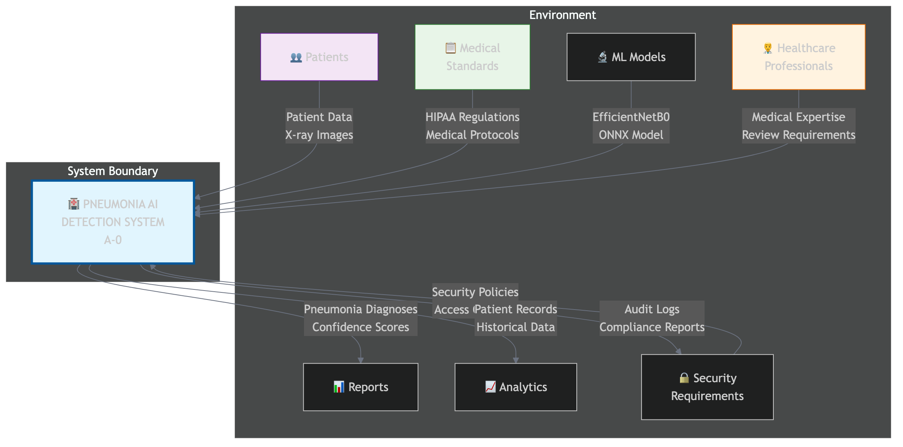
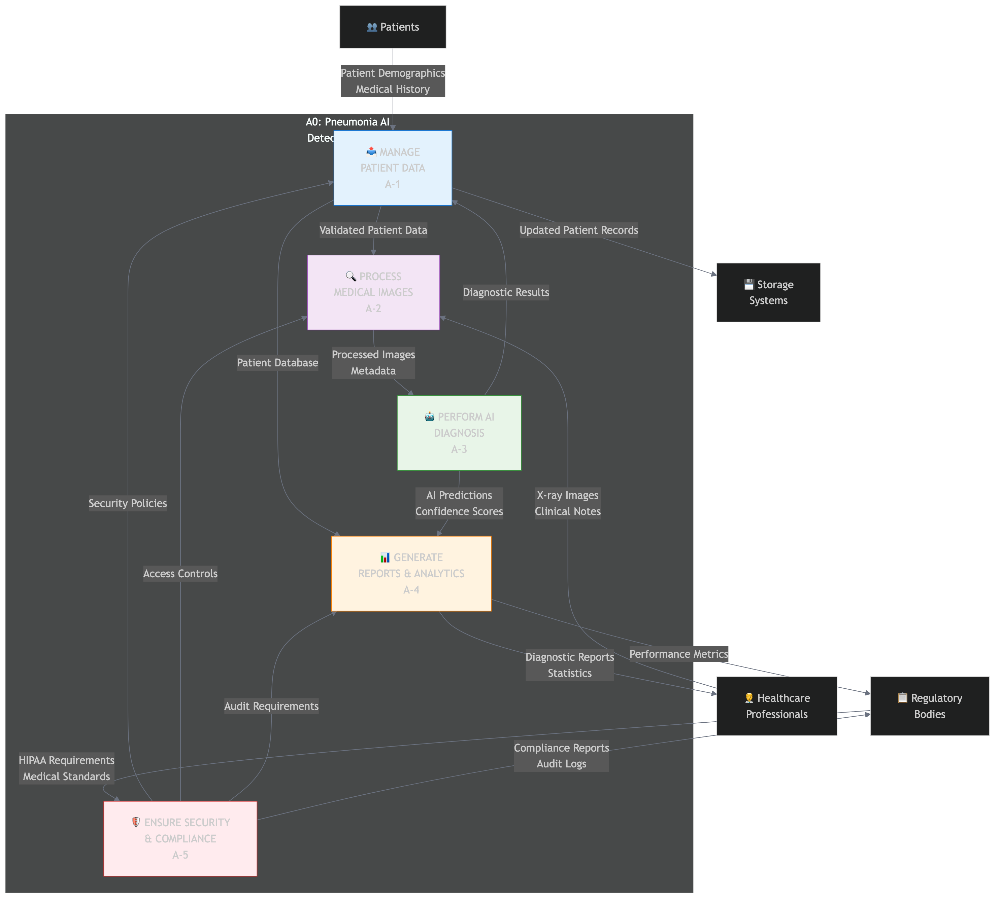
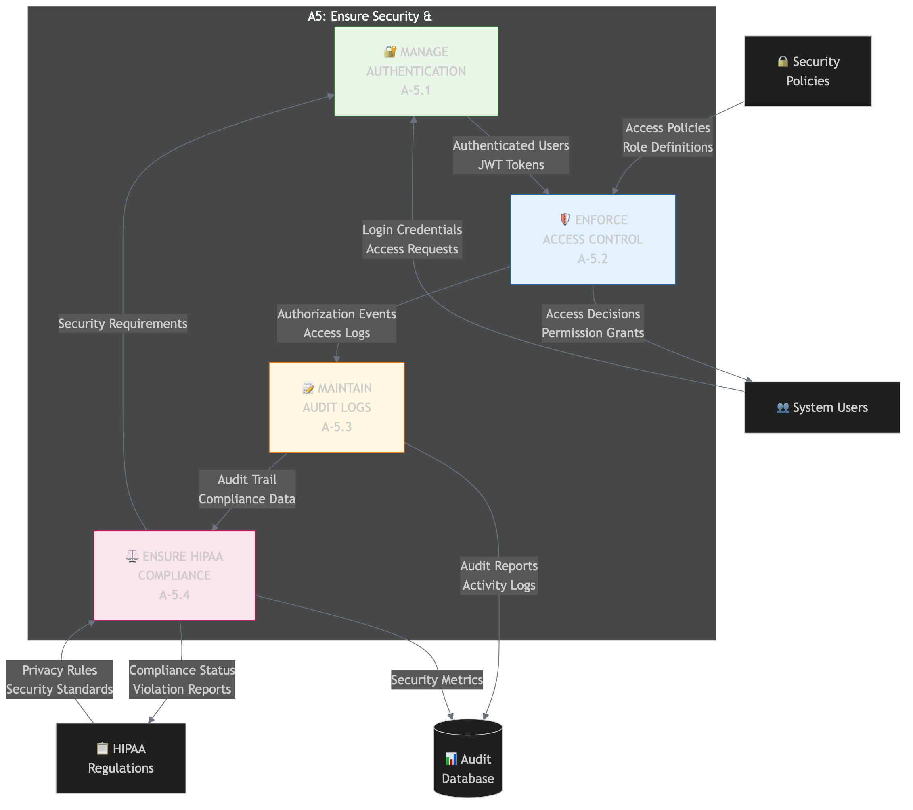

# 📊 IDEF0 Functional Model - Pneumonia AI Detection System

> **📊 High-Quality Diagrams**: All IDEF0 functional diagrams are available as PNG images in the [`docs/idef0-functional-diagrams/`](docs/idef0-functional-diagrams/) directory. The diagrams are generated from Mermaid source files and can be regenerated using the provided script.

## Context Diagram (A-0 Level)

*The context diagram shows the Pneumonia AI Detection System within its environment, highlighting external entities and system boundaries with clear input/output flows.*

## Level A0 Decomposition

*The A0 decomposition breaks down the main system into five major functions, showing the inter-function flows and external interfaces with clear ICOM relationships.*

## Level A-1 Decomposition: Manage Patient Data

*The A1 function manages all patient-related data operations including registration, validation, record management, and secure data handling.*

## Level A-2 Decomposition: Process Medical Images

*The A2 function handles comprehensive medical image processing including upload validation, standardization, preprocessing, and quality assurance for AI analysis.*

## Level A-3 Decomposition: Perform AI Diagnosis

*The A3 function represents the core AI diagnostic capability, including model loading, inference execution, result interpretation, and confidence assessment.*

## Level A-4 Decomposition: Generate Reports & Analytics

*The A4 function handles comprehensive reporting and analytics including diagnostic report generation, statistical analysis, performance monitoring, and regulatory compliance reporting.*

## Level A-5 Decomposition: Ensure Security & Compliance

*The A5 function manages comprehensive security and compliance including authentication, authorization, encryption, audit logging, and regulatory compliance monitoring.*

## ICOM Matrix Summary

| Function | Inputs (I) | Controls (C) | Outputs (O) | Mechanisms (M) |
|----------|-----------|-------------|-------------|---------------|
| **A-1: Manage Patient Data** | Patient Demographics, Medical History | Healthcare Staff Oversight, Data Validation Rules | Patient Records, Updated Database | PostgreSQL, SQLAlchemy ORM |
| **A-2: Process Medical Images** | Raw X-ray Images, DICOM Files | File Validation Rules, Size Limits | Processed Images, Metadata | PIL, OpenCV, File Storage |
| **A-3: Perform AI Diagnosis** | Normalized Image Tensors | Confidence Thresholds, Medical Standards | Diagnosis Results, Confidence Scores | ONNX Runtime, EfficientNetB0 |
| **A-4: Generate Reports** | Patient Data, AI Predictions | Reporting Standards, Export Formats | Medical Reports, Statistics | React Dashboard, Export Services |
| **A-5: Security & Compliance** | User Credentials, Access Requests | HIPAA Regulations, Security Policies | Audit Logs, Compliance Reports | JWT Authentication, Access Control |

## Technology Stack Mapping

### Backend (Python/FastAPI)
- **A-1**: SQLAlchemy ORM, Pydantic models
- **A-2**: PIL, OpenCV, File handling
- **A-3**: ONNX Runtime, NumPy, ML inference
- **A-4**: FastAPI endpoints, JSON serialization
- **A-5**: JWT tokens, Middleware, Logging

### Frontend (React/TypeScript)
- **A-1**: Patient management forms, CRUD operations
- **A-2**: File upload components, Image preview
- **A-3**: Prediction interface, Result display
- **A-4**: Dashboard charts, Export functionality
- **A-5**: Authentication forms, Access control UI

### Data Storage
- **Patient Data**: PostgreSQL database
- **Images**: File system storage
- **Model**: ONNX model files
- **Logs**: Database audit tables
- **Cache**: Redis (optional)
