# 📊 IDEF0 Functional Model - Pneumonia AI Detection System

## Context Diagram (A-0 Level)

```mermaid
graph TB
    subgraph "Environment"
        D[👨‍⚕️ Healthcare<br/>Professionals]
        C[📋 Medical<br/>Standards]
        M[🔬 ML Models]
        P[👥 Patients]
        R[📊 Reports]
        A[📈 Analytics]
        S[🔒 Security<br/>Requirements]
    end

    subgraph "System Boundary"
        A0[🏥 PNEUMONIA AI<br/>DETECTION SYSTEM<br/>A-0]
    end

    %% Inputs
    P -->|Patient Data<br/>X-ray Images| A0
    C -->|HIPAA Regulations<br/>Medical Protocols| A0
    M -->|EfficientNetB0<br/>ONNX Model| A0
    S -->|Security Policies<br/>Access Controls| A0
    
    %% Controls
    D -->|Medical Expertise<br/>Review Requirements| A0
    
    %% Outputs
    A0 -->|Pneumonia Diagnoses<br/>Confidence Scores| R
    A0 -->|Patient Records<br/>Historical Data| A
    A0 -->|Audit Logs<br/>Compliance Reports| S

    style A0 fill:#e1f5fe,stroke:#01579b,stroke-width:3px
    style D fill:#fff3e0,stroke:#ef6c00
    style P fill:#f3e5f5,stroke:#6a1b9a
    style C fill:#e8f5e8,stroke:#2e7d32
```

## Level A0 Decomposition

```mermaid
graph TB
    subgraph "A0: Pneumonia AI Detection System"
        A1[📤 MANAGE<br/>PATIENT DATA<br/>A-1]
        A2[🔍 PROCESS<br/>MEDICAL IMAGES<br/>A-2]
        A3[🤖 PERFORM AI<br/>DIAGNOSIS<br/>A-3]
        A4[📊 GENERATE<br/>REPORTS & ANALYTICS<br/>A-4]
        A5[🛡️ ENSURE SECURITY<br/>& COMPLIANCE<br/>A-5]
    end

    %% External Entities
    DOC[👨‍⚕️ Healthcare<br/>Professionals]
    PAT[👥 Patients]
    REG[📋 Regulatory<br/>Bodies]
    SYS[💾 Storage<br/>Systems]

    %% Inputs from External
    PAT -->|Patient Demographics<br/>Medical History| A1
    DOC -->|X-ray Images<br/>Clinical Notes| A2
    REG -->|HIPAA Requirements<br/>Medical Standards| A5

    %% Inter-function flows
    A1 -->|Validated Patient Data| A2
    A1 -->|Patient Database| A4
    A2 -->|Processed Images<br/>Metadata| A3
    A3 -->|AI Predictions<br/>Confidence Scores| A4
    A3 -->|Diagnostic Results| A1
    A5 -->|Security Policies| A1
    A5 -->|Access Controls| A2
    A5 -->|Audit Requirements| A4

    %% Outputs to External
    A1 -->|Updated Patient Records| SYS
    A4 -->|Diagnostic Reports<br/>Statistics| DOC
    A4 -->|Performance Metrics| REG
    A5 -->|Compliance Reports<br/>Audit Logs| REG

    style A1 fill:#e3f2fd,stroke:#1976d2
    style A2 fill:#f3e5f5,stroke:#7b1fa2
    style A3 fill:#e8f5e8,stroke:#388e3c
    style A4 fill:#fff3e0,stroke:#f57c00
    style A5 fill:#ffebee,stroke:#d32f2f
```

## Level A-1 Decomposition: Manage Patient Data

```mermaid
graph TB
    subgraph "A1: Manage Patient Data"
        A11[📝 REGISTER<br/>NEW PATIENTS<br/>A-1.1]
        A12[📋 UPDATE PATIENT<br/>INFORMATION<br/>A-1.2]
        A13[🔍 SEARCH & RETRIEVE<br/>PATIENT RECORDS<br/>A-1.3]
        A14[📈 TRACK PATIENT<br/>HISTORY<br/>A-1.4]
    end

    %% External inputs
    DOC[👨‍⚕️ Healthcare Staff]
    PAT[👥 Patients]
    DB[(🗃️ PostgreSQL<br/>Database)]

    %% Inputs
    PAT -->|Personal Information<br/>Medical History| A11
    DOC -->|Patient Updates<br/>Medical Notes| A12
    DOC -->|Search Queries<br/>Patient ID| A13

    %% Inter-function flows
    A11 -->|New Patient Record| A12
    A11 -->|Patient Database| DB
    A12 -->|Updated Records| A13
    A12 -->|Patient Changes| A14
    A13 -->|Patient Data| A14

    %% Outputs
    A13 -->|Patient Information<br/>Medical Records| DOC
    A14 -->|Patient Timeline<br/>Historical Data| DOC
    A14 -->|Updated Records| DB

    style A11 fill:#e8f5e8,stroke:#2e7d32
    style A12 fill:#e3f2fd,stroke:#1565c0
    style A13 fill:#fff8e1,stroke:#f57f17
    style A14 fill:#fce4ec,stroke:#c2185b
```

## Level A-2 Decomposition: Process Medical Images

```mermaid
graph TB
    subgraph "A2: Process Medical Images"
        A21[📤 UPLOAD & VALIDATE<br/>X-RAY IMAGES<br/>A-2.1]
        A22[🔧 PREPROCESS<br/>IMAGES<br/>A-2.2]
        A23[💾 STORE & MANAGE<br/>MEDICAL FILES<br/>A-2.3]
        A24[🔍 EXTRACT IMAGE<br/>METADATA<br/>A-2.4]
    end

    %% External entities
    DOC[👨‍⚕️ Radiologists]
    STORE[(📁 File Storage<br/>System)]
    VALID[✅ Validation<br/>Rules]

    %% Inputs
    DOC -->|Raw X-ray Images<br/>DICOM Files| A21
    VALID -->|File Type Rules<br/>Size Limits| A21

    %% Inter-function flows
    A21 -->|Validated Images| A22
    A22 -->|Processed Images<br/>224x224 RGB| A23
    A22 -->|Image Tensors| A24
    A23 -->|File Paths<br/>Storage Info| A24

    %% Outputs
    A23 -->|Stored Images<br/>File References| STORE
    A24 -->|Image Metadata<br/>Preprocessing Info| DOC
    A24 -->|Ready for AI<br/>Normalized Images| A21

    style A21 fill:#e8f5e8,stroke:#2e7d32
    style A22 fill:#e3f2fd,stroke:#1565c0
    style A23 fill:#fff8e1,stroke:#f57f17
    style A24 fill:#fce4ec,stroke:#c2185b
```

## Level A-3 Decomposition: Perform AI Diagnosis

```mermaid
graph TB
    subgraph "A3: Perform AI Diagnosis"
        A31[🚀 LOAD AI MODEL<br/>ONNX Runtime<br/>A-3.1]
        A32[🧠 RUN INFERENCE<br/>EfficientNetB0<br/>A-3.2]
        A33[📊 CALCULATE<br/>CONFIDENCE SCORES<br/>A-3.3]
        A34[⚖️ VALIDATE &<br/>INTERPRET RESULTS<br/>A-3.4]
    end

    %% External entities
    MODEL[🤖 EfficientNetB0<br/>ONNX Model]
    THRESH[📏 Confidence<br/>Thresholds]
    VALID[✅ Medical<br/>Validation Rules]

    %% Inputs
    MODEL -->|Pre-trained Weights<br/>Model Architecture| A31
    THRESH -->|Confidence Threshold<br/>0.7 Default| A33

    %% From A2
    A2_OUT[📤 From A-2<br/>Processed Images] -->|Normalized Tensors<br/>224x224x3| A32

    %% Inter-function flows
    A31 -->|Loaded Model<br/>Session Object| A32
    A32 -->|Raw Predictions<br/>Logits| A33
    A33 -->|Probability Scores<br/>NORMAL/PNEUMONIA| A34
    A34 -->|Validated Results| A33

    %% Outputs
    A34 -->|Diagnosis Result<br/>Confidence Score| A4_IN[📥 To A-4<br/>Reports & Analytics]
    A34 -->|Prediction Metadata<br/>Inference Time| A1_IN[📥 To A-1<br/>Patient Records]

    %% Validation
    VALID -->|Medical Interpretation<br/>Quality Checks| A34

    style A31 fill:#e8f5e8,stroke:#2e7d32
    style A32 fill:#e3f2fd,stroke:#1565c0
    style A33 fill:#fff8e1,stroke:#f57f17
    style A34 fill:#fce4ec,stroke:#c2185b
```

## Level A-4 Decomposition: Generate Reports & Analytics

```mermaid
graph TB
    subgraph "A4: Generate Reports & Analytics"
        A41[📊 COMPILE<br/>DIAGNOSTIC REPORTS<br/>A-4.1]
        A42[📈 GENERATE<br/>STATISTICS<br/>A-4.2]
        A43[📋 CREATE<br/>EXPORT FILES<br/>A-4.3]
        A44[📱 UPDATE<br/>DASHBOARD<br/>A-4.4]
    end

    %% External entities
    DOC[👨‍⚕️ Healthcare<br/>Professionals]
    ADMIN[👩‍💼 System<br/>Administrators]
    EXPORT[(📁 Export<br/>Storage)]

    %% From other functions
    A1_DATA[📥 From A-1<br/>Patient Data]
    A3_PRED[📥 From A-3<br/>AI Predictions]

    %% Inputs
    A1_DATA -->|Patient Records<br/>Demographics| A41
    A3_PRED -->|Diagnosis Results<br/>Confidence Scores| A41
    A3_PRED -->|Prediction Metrics| A42

    %% Inter-function flows
    A41 -->|Individual Reports<br/>Patient Summaries| A43
    A42 -->|Aggregated Stats<br/>Performance Metrics| A44
    A42 -->|Statistical Data| A43
    A44 -->|Dashboard Data| A42

    %% Outputs
    A41 -->|Medical Reports<br/>Clinical Summaries| DOC
    A43 -->|CSV Files<br/>PDF Reports| EXPORT
    A44 -->|Real-time Updates<br/>Live Statistics| DOC
    A44 -->|System Metrics| ADMIN

    style A41 fill:#e8f5e8,stroke:#2e7d32
    style A42 fill:#e3f2fd,stroke:#1565c0
    style A43 fill:#fff8e1,stroke:#f57f17
    style A44 fill:#fce4ec,stroke:#c2185b
```

## Level A-5 Decomposition: Ensure Security & Compliance

```mermaid
graph TB
    subgraph "A5: Ensure Security & Compliance"
        A51[🔐 MANAGE<br/>AUTHENTICATION<br/>A-5.1]
        A52[🛡️ ENFORCE<br/>ACCESS CONTROL<br/>A-5.2]
        A53[📝 MAINTAIN<br/>AUDIT LOGS<br/>A-5.3]
        A54[⚖️ ENSURE HIPAA<br/>COMPLIANCE<br/>A-5.4]
    end

    %% External entities
    USERS[👥 System Users]
    HIPAA[📋 HIPAA<br/>Regulations]
    AUDIT[(📊 Audit<br/>Database)]
    SECURITY[🔒 Security<br/>Policies]

    %% Inputs
    USERS -->|Login Credentials<br/>Access Requests| A51
    HIPAA -->|Privacy Rules<br/>Security Standards| A54
    SECURITY -->|Access Policies<br/>Role Definitions| A52

    %% Inter-function flows
    A51 -->|Authenticated Users<br/>JWT Tokens| A52
    A52 -->|Authorization Events<br/>Access Logs| A53
    A53 -->|Audit Trail<br/>Compliance Data| A54
    A54 -->|Security Requirements| A51

    %% Outputs
    A52 -->|Access Decisions<br/>Permission Grants| USERS
    A53 -->|Audit Reports<br/>Activity Logs| AUDIT
    A54 -->|Compliance Status<br/>Violation Reports| HIPAA
    A54 -->|Security Metrics| AUDIT

    style A51 fill:#e8f5e8,stroke:#2e7d32
    style A52 fill:#e3f2fd,stroke:#1565c0
    style A53 fill:#fff8e1,stroke:#f57f17
    style A54 fill:#fce4ec,stroke:#c2185b
```

## ICOM Matrix Summary

| Function | Inputs (I) | Controls (C) | Outputs (O) | Mechanisms (M) |
|----------|-----------|-------------|-------------|---------------|
| **A-1: Manage Patient Data** | Patient Demographics, Medical History | Healthcare Staff Oversight, Data Validation Rules | Patient Records, Updated Database | PostgreSQL, SQLAlchemy ORM |
| **A-2: Process Medical Images** | Raw X-ray Images, DICOM Files | File Validation Rules, Size Limits | Processed Images, Metadata | PIL, OpenCV, File Storage |
| **A-3: Perform AI Diagnosis** | Normalized Image Tensors | Confidence Thresholds, Medical Standards | Diagnosis Results, Confidence Scores | ONNX Runtime, EfficientNetB0 |
| **A-4: Generate Reports** | Patient Data, AI Predictions | Reporting Standards, Export Formats | Medical Reports, Statistics | React Dashboard, Export Services |
| **A-5: Security & Compliance** | User Credentials, Access Requests | HIPAA Regulations, Security Policies | Audit Logs, Compliance Reports | JWT Authentication, Access Control |

## Technology Stack Mapping

### Backend (Python/FastAPI)
- **A-1**: SQLAlchemy ORM, Pydantic models
- **A-2**: PIL, OpenCV, File handling
- **A-3**: ONNX Runtime, NumPy, ML inference
- **A-4**: FastAPI endpoints, JSON serialization
- **A-5**: JWT tokens, Middleware, Logging

### Frontend (React/TypeScript)
- **A-1**: Patient management forms, CRUD operations
- **A-2**: File upload components, Image preview
- **A-3**: Prediction interface, Result display
- **A-4**: Dashboard charts, Export functionality
- **A-5**: Authentication forms, Access control UI

### Data Storage
- **Patient Data**: PostgreSQL database
- **Images**: File system storage
- **Model**: ONNX model files
- **Logs**: Database audit tables
- **Cache**: Redis (optional)
