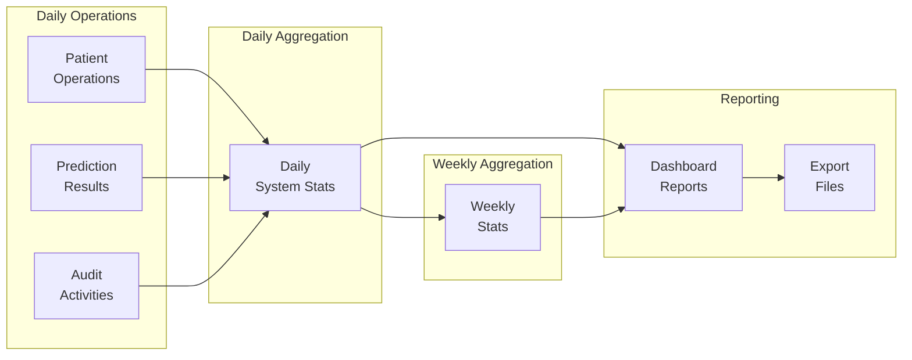

# 🗄️ IDEF1x Data Model - Pneumonia AI Detection System

## Entity-Relationship Diagram (ERD)


## Detailed Entity Specifications

### 🧑‍⚕️ PATIENT Entity

**Purpose**: Store comprehensive patient demographic and medical information

| Attribute | Data Type | Constraints | Description |
|-----------|-----------|-------------|-------------|
| `id` | INTEGER | PK, NOT NULL, AUTO_INCREMENT | Internal database identifier |
| `patient_id` | VARCHAR(50) | UNIQUE, NOT NULL, INDEX | Human-readable patient ID |
| `first_name` | VARCHAR(100) | NOT NULL | Patient's first name |
| `last_name` | VARCHAR(100) | NOT NULL | Patient's last name |
| `age` | INTEGER | CHECK (age >= 0 AND age <= 150) | Patient age in years |
| `gender` | VARCHAR(10) | CHECK (gender IN ('Male', 'Female', 'Other')) | Patient gender |
| `phone` | VARCHAR(20) | NULL | Contact phone number |
| `email` | VARCHAR(100) | NULL, EMAIL FORMAT | Email address |
| `address` | TEXT | NULL | Home address |
| `medical_record_number` | VARCHAR(50) | NULL, UNIQUE | Hospital MRN |
| `emergency_contact` | JSON | NULL | Emergency contact information |
| `insurance_info` | JSON | NULL | Insurance provider details |
| `created_at` | TIMESTAMP | NOT NULL, DEFAULT CURRENT_TIMESTAMP | Record creation time |
| `updated_at` | TIMESTAMP | NULL, ON UPDATE CURRENT_TIMESTAMP | Last modification time |

**Sample JSON Structures**:
```json
{
  "emergency_contact": {
    "name": "John Smith",
    "phone": "+1-555-0123",
    "relationship": "Spouse"
  },
  "insurance_info": {
    "provider": "Blue Cross Blue Shield",
    "policy_number": "BC123456789",
    "group_number": "GRP001"
  }
}
```

### 🔬 PREDICTION Entity

**Purpose**: Store AI diagnosis results and associated metadata

| Attribute | Data Type | Constraints | Description |
|-----------|-----------|-------------|-------------|
| `id` | VARCHAR(36) | PK, NOT NULL, UUID | Unique prediction identifier |
| `patient_id` | INTEGER | FK, NULL | Reference to patient (nullable for anonymous) |
| `image_filename` | VARCHAR(255) | NOT NULL | Generated filename for storage |
| `original_filename` | VARCHAR(255) | NULL | Original uploaded filename |
| `image_path` | VARCHAR(500) | NOT NULL | Full file system path |
| `prediction` | VARCHAR(20) | NOT NULL, CHECK (prediction IN ('NORMAL', 'PNEUMONIA')) | AI diagnosis result |
| `confidence` | DECIMAL(5,4) | NOT NULL, CHECK (confidence >= 0 AND confidence <= 1) | Overall confidence score |
| `confidence_scores` | JSON | NOT NULL | Detailed class probabilities |
| `inference_time` | DECIMAL(8,4) | NULL | AI processing time in seconds |
| `image_size` | JSON | NULL | Image dimensions [width, height] |
| `clinical_notes` | TEXT | NULL | Radiologist or doctor notes |
| `reviewed` | BOOLEAN | NOT NULL, DEFAULT FALSE | Manual review status |
| `reviewed_by` | VARCHAR(100) | NULL | Reviewer identifier |
| `reviewed_at` | TIMESTAMP | NULL | Review completion time |
| `created_at` | TIMESTAMP | NOT NULL, DEFAULT CURRENT_TIMESTAMP | Prediction timestamp |

**Sample JSON Structures**:
```json
{
  "confidence_scores": {
    "NORMAL": 0.2534,
    "PNEUMONIA": 0.7466
  },
  "image_size": [512, 512]
}
```

### 📝 AUDIT_LOG Entity

**Purpose**: Maintain comprehensive audit trail for HIPAA compliance

| Attribute | Data Type | Constraints | Description |
|-----------|-----------|-------------|-------------|
| `id` | INTEGER | PK, NOT NULL, AUTO_INCREMENT | Log entry identifier |
| `user_id` | VARCHAR(100) | NOT NULL, INDEX | User performing action |
| `action_type` | VARCHAR(50) | NOT NULL, INDEX | Category of action performed |
| `entity_type` | VARCHAR(50) | NULL | Type of entity affected |
| `entity_id` | VARCHAR(50) | NULL | Identifier of affected entity |
| `details` | JSON | NULL | Additional action details |
| `ip_address` | VARCHAR(45) | NULL | IPv4 or IPv6 address |
| `user_agent` | TEXT | NULL | Browser/client information |
| `timestamp` | TIMESTAMP | NOT NULL, DEFAULT CURRENT_TIMESTAMP, INDEX | Action timestamp |

**Action Types**:
- `LOGIN`, `LOGOUT`, `FAILED_LOGIN`
- `CREATE_PATIENT`, `UPDATE_PATIENT`, `DELETE_PATIENT`, `VIEW_PATIENT`
- `UPLOAD_IMAGE`, `RUN_PREDICTION`, `REVIEW_PREDICTION`
- `EXPORT_DATA`, `GENERATE_REPORT`
- `ADMIN_ACTION`, `SYSTEM_ERROR`

### 📊 SYSTEM_STATS Entity

**Purpose**: Store daily system performance and usage statistics

| Attribute | Data Type | Constraints | Description |
|-----------|-----------|-------------|-------------|
| `id` | INTEGER | PK, NOT NULL, AUTO_INCREMENT | Statistics record ID |
| `date` | DATE | NOT NULL, UNIQUE, INDEX | Statistics date |
| `total_patients` | INTEGER | NOT NULL, DEFAULT 0 | Cumulative patient count |
| `total_predictions` | INTEGER | NOT NULL, DEFAULT 0 | Cumulative prediction count |
| `predictions_today` | INTEGER | NOT NULL, DEFAULT 0 | Daily prediction count |
| `pneumonia_cases` | INTEGER | NOT NULL, DEFAULT 0 | Positive pneumonia cases |
| `normal_cases` | INTEGER | NOT NULL, DEFAULT 0 | Normal/negative cases |
| `average_confidence` | DECIMAL(5,4) | DEFAULT 0.0 | Average AI confidence |
| `model_accuracy` | DECIMAL(5,4) | DEFAULT 0.0 | Model performance metric |
| `active_users` | INTEGER | DEFAULT 0 | Daily active users |
| `created_at` | TIMESTAMP | NOT NULL, DEFAULT CURRENT_TIMESTAMP | Record creation time |

### 📈 WEEKLY_STATS Entity

**Purpose**: Aggregate weekly performance metrics for trending analysis

| Attribute | Data Type | Constraints | Description |
|-----------|-----------|-------------|-------------|
| `id` | INTEGER | PK, NOT NULL, AUTO_INCREMENT | Weekly stats ID |
| `week_start` | DATE | NOT NULL, INDEX | Week starting date (Monday) |
| `week_end` | DATE | NOT NULL | Week ending date (Sunday) |
| `predictions_count` | INTEGER | NOT NULL, DEFAULT 0 | Total weekly predictions |
| `accuracy_rate` | DECIMAL(5,4) | DEFAULT 0.0 | Weekly accuracy percentage |
| `pneumonia_detected` | INTEGER | NOT NULL, DEFAULT 0 | Pneumonia cases detected |
| `normal_cases` | INTEGER | NOT NULL, DEFAULT 0 | Normal cases |
| `unique_patients` | INTEGER | NOT NULL, DEFAULT 0 | Unique patients served |
| `created_at` | TIMESTAMP | NOT NULL, DEFAULT CURRENT_TIMESTAMP | Stats generation time |

## Relationship Specifications

### 🔗 PATIENT → PREDICTION (One-to-Many)

**Relationship Type**: Identifying, Optional

**Business Rules**:
- One patient can have multiple predictions over time
- Predictions can exist without a patient (anonymous mode)
- Cascade deletion policy: RESTRICT (prevent patient deletion if predictions exist)

**Foreign Key**: `PREDICTION.patient_id` → `PATIENT.id`

```sql
CONSTRAINT fk_prediction_patient 
FOREIGN KEY (patient_id) REFERENCES patient(id) 
ON DELETE RESTRICT ON UPDATE CASCADE
```

### 🔗 PATIENT → AUDIT_LOG (One-to-Many)

**Relationship Type**: Non-Identifying, Optional

**Business Rules**:
- Patient actions are logged for compliance
- Audit logs persist even if patient is deleted
- Multiple log entries per patient action

**Relationship**: Through `entity_type = 'PATIENT'` and `entity_id = patient.patient_id`

### 🔗 PREDICTION → AUDIT_LOG (One-to-Many)

**Relationship Type**: Non-Identifying, Optional

**Business Rules**:
- Prediction operations are logged
- Includes upload, analysis, review actions
- Audit trails persist independently

**Relationship**: Through `entity_type = 'PREDICTION'` and `entity_id = prediction.id`

### 🔗 SYSTEM_STATS → WEEKLY_STATS (One-to-Many)

**Relationship Type**: Non-Identifying, Derived

**Business Rules**:
- Weekly stats are aggregated from daily system stats
- No direct foreign key relationship
- Computed relationship based on date ranges

## Data Integrity Constraints

### Primary Key Constraints
```sql
-- All tables have unique primary keys
ALTER TABLE patient ADD CONSTRAINT pk_patient PRIMARY KEY (id);
ALTER TABLE prediction ADD CONSTRAINT pk_prediction PRIMARY KEY (id);
ALTER TABLE audit_log ADD CONSTRAINT pk_audit_log PRIMARY KEY (id);
ALTER TABLE system_stats ADD CONSTRAINT pk_system_stats PRIMARY KEY (id);
ALTER TABLE weekly_stats ADD CONSTRAINT pk_weekly_stats PRIMARY KEY (id);
```

### Unique Constraints
```sql
-- Business unique constraints
ALTER TABLE patient ADD CONSTRAINT uk_patient_id UNIQUE (patient_id);
ALTER TABLE patient ADD CONSTRAINT uk_medical_record UNIQUE (medical_record_number);
ALTER TABLE system_stats ADD CONSTRAINT uk_stats_date UNIQUE (date);
ALTER TABLE weekly_stats ADD CONSTRAINT uk_week_range UNIQUE (week_start, week_end);
```

### Check Constraints
```sql
-- Data validation constraints
ALTER TABLE patient ADD CONSTRAINT ck_patient_age 
  CHECK (age IS NULL OR (age >= 0 AND age <= 150));

ALTER TABLE patient ADD CONSTRAINT ck_patient_gender 
  CHECK (gender IS NULL OR gender IN ('Male', 'Female', 'Other'));

ALTER TABLE prediction ADD CONSTRAINT ck_prediction_class 
  CHECK (prediction IN ('NORMAL', 'PNEUMONIA'));

ALTER TABLE prediction ADD CONSTRAINT ck_confidence_range 
  CHECK (confidence >= 0.0 AND confidence <= 1.0);

ALTER TABLE system_stats ADD CONSTRAINT ck_positive_counts 
  CHECK (total_patients >= 0 AND total_predictions >= 0 AND predictions_today >= 0);
```

### Index Specifications
```sql
-- Performance optimization indexes
CREATE INDEX idx_patient_name ON patient(last_name, first_name);
CREATE INDEX idx_patient_created ON patient(created_at);
CREATE INDEX idx_prediction_patient ON prediction(patient_id);
CREATE INDEX idx_prediction_date ON prediction(created_at);
CREATE INDEX idx_prediction_result ON prediction(prediction, confidence);
CREATE INDEX idx_audit_user ON audit_log(user_id, timestamp);
CREATE INDEX idx_audit_action ON audit_log(action_type, timestamp);
CREATE INDEX idx_stats_date ON system_stats(date);
CREATE INDEX idx_weekly_range ON weekly_stats(week_start, week_end);
```

## Data Flow Patterns

### 🔄 Prediction Workflow Data Flow


### 📊 Analytics Data Aggregation



## HIPAA Compliance Data Classification

### 🔒 Protected Health Information (PHI)

**Highly Sensitive Data**:
- `patient.first_name`, `patient.last_name`
- `patient.phone`, `patient.email`, `patient.address`
- `patient.medical_record_number`
- `prediction.image_filename`, `prediction.image_path`
- `prediction.clinical_notes`

**Access Controls**:
- Role-based access permissions
- Audit logging for all PHI access
- Encryption at rest and in transit
- Regular access reviews

### 📋 De-identified Data

**Research/Analytics Safe**:
- `patient.age`, `patient.gender` (aggregated)
- `prediction.prediction`, `prediction.confidence`
- `system_stats.*` (aggregated metrics)
- `weekly_stats.*` (aggregated trends)

### 🔍 Audit Requirements

**Mandatory Logging**:
- All PHI access and modifications
- User authentication events
- Data export operations
- System administration changes
- Failed access attempts

**Retention Policy**:
- Audit logs: 6 years minimum
- Patient data: Per institutional policy
- Prediction results: Per medical guidelines
- Statistics: Indefinite (de-identified)

## Database Schema DDL

```sql
-- Complete schema creation script
CREATE SCHEMA pneumonia_ai;
USE pneumonia_ai;

-- Patient table
CREATE TABLE patient (
    id INTEGER PRIMARY KEY AUTO_INCREMENT,
    patient_id VARCHAR(50) NOT NULL UNIQUE,
    first_name VARCHAR(100) NOT NULL,
    last_name VARCHAR(100) NOT NULL,
    age INTEGER CHECK (age >= 0 AND age <= 150),
    gender VARCHAR(10) CHECK (gender IN ('Male', 'Female', 'Other')),
    phone VARCHAR(20),
    email VARCHAR(100),
    address TEXT,
    medical_record_number VARCHAR(50) UNIQUE,
    emergency_contact JSON,
    insurance_info JSON,
    created_at TIMESTAMP DEFAULT CURRENT_TIMESTAMP,
    updated_at TIMESTAMP ON UPDATE CURRENT_TIMESTAMP,
    INDEX idx_patient_name (last_name, first_name),
    INDEX idx_patient_created (created_at)
);

-- Prediction table
CREATE TABLE prediction (
    id VARCHAR(36) PRIMARY KEY,
    patient_id INTEGER,
    image_filename VARCHAR(255) NOT NULL,
    original_filename VARCHAR(255),
    image_path VARCHAR(500) NOT NULL,
    prediction VARCHAR(20) NOT NULL CHECK (prediction IN ('NORMAL', 'PNEUMONIA')),
    confidence DECIMAL(5,4) NOT NULL CHECK (confidence >= 0 AND confidence <= 1),
    confidence_scores JSON NOT NULL,
    inference_time DECIMAL(8,4),
    image_size JSON,
    clinical_notes TEXT,
    reviewed BOOLEAN DEFAULT FALSE,
    reviewed_by VARCHAR(100),
    reviewed_at TIMESTAMP NULL,
    created_at TIMESTAMP DEFAULT CURRENT_TIMESTAMP,
    FOREIGN KEY (patient_id) REFERENCES patient(id) ON DELETE RESTRICT,
    INDEX idx_prediction_patient (patient_id),
    INDEX idx_prediction_date (created_at),
    INDEX idx_prediction_result (prediction, confidence)
);

-- Audit log table
CREATE TABLE audit_log (
    id INTEGER PRIMARY KEY AUTO_INCREMENT,
    user_id VARCHAR(100) NOT NULL,
    action_type VARCHAR(50) NOT NULL,
    entity_type VARCHAR(50),
    entity_id VARCHAR(50),
    details JSON,
    ip_address VARCHAR(45),
    user_agent TEXT,
    timestamp TIMESTAMP DEFAULT CURRENT_TIMESTAMP,
    INDEX idx_audit_user (user_id, timestamp),
    INDEX idx_audit_action (action_type, timestamp)
);

-- System statistics table
CREATE TABLE system_stats (
    id INTEGER PRIMARY KEY AUTO_INCREMENT,
    date DATE NOT NULL UNIQUE,
    total_patients INTEGER DEFAULT 0,
    total_predictions INTEGER DEFAULT 0,
    predictions_today INTEGER DEFAULT 0,
    pneumonia_cases INTEGER DEFAULT 0,
    normal_cases INTEGER DEFAULT 0,
    average_confidence DECIMAL(5,4) DEFAULT 0.0,
    model_accuracy DECIMAL(5,4) DEFAULT 0.0,
    active_users INTEGER DEFAULT 0,
    created_at TIMESTAMP DEFAULT CURRENT_TIMESTAMP,
    INDEX idx_stats_date (date)
);

-- Weekly statistics table
CREATE TABLE weekly_stats (
    id INTEGER PRIMARY KEY AUTO_INCREMENT,
    week_start DATE NOT NULL,
    week_end DATE NOT NULL,
    predictions_count INTEGER DEFAULT 0,
    accuracy_rate DECIMAL(5,4) DEFAULT 0.0,
    pneumonia_detected INTEGER DEFAULT 0,
    normal_cases INTEGER DEFAULT 0,
    unique_patients INTEGER DEFAULT 0,
    created_at TIMESTAMP DEFAULT CURRENT_TIMESTAMP,
    UNIQUE KEY uk_week_range (week_start, week_end),
    INDEX idx_weekly_range (week_start, week_end)
);
```
