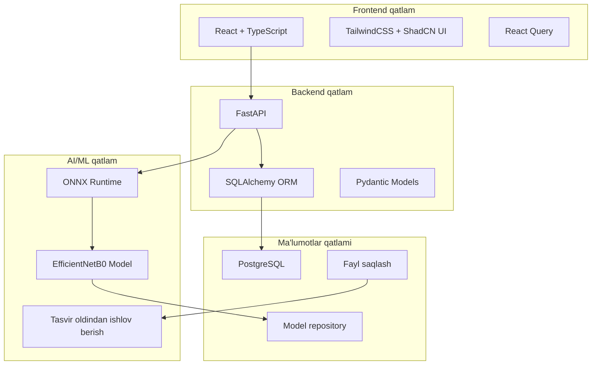

# 🏥 Pnevmoniya AI Detektori

<div align="center">


**Ko'krak qafasi rentgen tasvirlarini tahlil qilish orqali pnevmoniyani aniqlash uchun ilg'or AI tizimi**

[🚀 Jonli Demo](#demo) • [📖 Hujjatlar](#hujjatlar) • [🛠️ O'rnatish](#ornatish) • [🤝 Hissa qo'shish](#hissa-qoshish) • [🇺🇸 English](README.md)

</div>

> **🇺🇸 English**: [README.md](README.md) - Complete documentation in English

---

## 📋 **Mundarija**

- [🎯 Umumiy ma'lumot](#umumiy-malumot)
- [✨ Xususiyatlar](#xususiyatlar)
- [🏗️ Arxitektura](#arxitektura)
- [🚀 Tezkor boshlash](#tezkor-boshlash)
- [💻 O'rnatish](#ornatish)
- [📱 Foydalanish](#foydalanish)
- [🔬 Model haqida](#model-haqida)
- [🛡️ Xavfsizlik](#xavfsizlik)
- [📊 Ishlash ko'rsatkichlari](#ishlash-korsatkichlari)
- [🤝 Hissa qo'shish](#hissa-qoshish)
- [📄 Litsenziya](#litsenziya)

---

## 🎯 **Umumiy ma'lumot**

Pnevmoniya AI Detektori - bu sog'liqni saqlash mutaxassislariga ko'krak qafasi rentgen tasvirlaridan pnevmoniyani tashxislashda yordam berish uchun mo'ljallangan keng qamrovli tibbiy AI ilovasi. Zamonaviy mashina o'rganish texnologiyalari va zamonaviy veb texnologiyalar bilan yaratilgan ushbu tizim aniq, tez va ishonchli pnevmoniya aniqlash imkoniyatlarini taqdim etadi.

### 🎪 **Jonli Demo**
*🚧 Demo tez orada mavjud bo'ladi - Kuting!*

### 🌟 **Asosiy Ajoyibliklar**
- 🤖 **AI-Powered**: ONNX runtime bilan optimallashtirilgan EfficientNetB0 modeli
- 🏥 **Tibbiy Sifat**: Sog'liqni saqlash muhitlari uchun HIPAA-ga mos dizayn
- 🌐 **To'liq Stack**: FastAPI backend bilan zamonaviy React frontend
- 🚀 **Ishlab chiqarishga tayyor**: Docker konteynerlashtirish va nginx deployment
- 🇺🇿 **Mahalliylashtirilgan**: Mahalliy sog'liqni saqlash uchun o'zbek tili qo'llab-quvvatlash

---

## ✨ **Xususiyatlar**

### 🔬 **Tibbiy AI Imkoniyatlari**
- **Yuqori Aniqlikdagi Pnevmoniya Aniqlash** - Ilg'or EfficientNetB0 modeli
- **Real-vaqt Tahlili** - ONNX runtime optimallashuvi bilan tez xulosa
- **Ishonch Ballari** - Tibbiy qarorlarni qo'llab-quvvatlash uchun ehtimollik ballari
- **Batch Ishlov Berish** - Bir nechta rentgen tahlili imkoniyatlari

### 👨‍⚕️ **Sog'liqni Saqlash Boshqaruvi**
- **Bemor Boshqaruv Tizimi** - To'liq bemor yozuvlari va tarixi
- **Bashorat Tarixi** - Barcha tashxis va natijalarni kuzatish
- **Tibbiy Dashboard** - Keng qamrovli statistika va tushunchalar
- **Eksport Imkoniyatlari** - Tibbiy yozuvlar uchun CSV eksport

### 🛡️ **Xavfsizlik va Muvofiqlik**
- **HIPAA Mos Dizayn** - Tibbiy ma'lumotlar maxfiyligi standartlari
- **Xavfsiz Fayl Boshqaruvi** - Shifrlangan tibbiy tasvir saqlash
- **Audit Jurnali** - Muvofiqlik uchun to'liq harakat kuzatuvi
- **Kirish Nazorati** - Rol asosidagi ruxsat tizimi

### 💻 **Texnik Xususiyatlar**
- **Zamonaviy UI/UX** - TailwindCSS va ShadCN bilan javobgar dizayn
- **REST API** - Keng qamrovli FastAPI backend
- **Real-vaqt Yangilanishlar** - Optimal ma'lumot boshqaruvi uchun React Query
- **Ko'p til** - O'zbek tilini mahalliylashtirishni qo'llab-quvvatlash

---

## 🏗️ **Arxitektura**



### 🔧 **Texnologiyalar to'plami**

#### **Backend**
- **Framework**: FastAPI 0.104+
- **Til**: Python 3.9+
- **Ma'lumotlar bazasi**: PostgreSQL va SQLAlchemy
- **ML Runtime**: ONNX Runtime
- **Autentifikatsiya**: JWT asosidagi xavfsizlik
- **Fayl boshqaruv**: Xavfsli tibbiy tasvir ishlov berish

#### **Frontend**
- **Framework**: React 18+ va TypeScript
- **Stillashtirish**: TailwindCSS + ShadCN UI komponentlari
- **Holat boshqaruvi**: React Query (TanStack Query)
- **Marshrutlash**: React Router v6
- **Qurish vositasi**: Create React App

#### **AI/ML**
- **Model**: EfficientNetB0 (pnevmoniya klassifikatsiyasi)
- **Runtime**: Optimallashtirilgan inference uchun ONNX
- **Oldindan ishlov berish**: PIL + NumPy tasvir ishlov berish
- **Format qo'llab-quvvatlash**: PNG, JPG, DICOM

---

## 🚀 **Tezkor boshlash**

### 📋 **Talablar**
- Python 3.9+
- Node.js 16+
- Docker va Docker Compose
- PostgreSQL (yoki Docker ishlatish)

### ⚡ **1-daqiqada sozlash**

```bash
# Repository'ni klonlash
git clone https://github.com/yourusername/pneumonia-ai-detector.git
cd pneumonia-ai-detector

# Docker bilan boshlash (Tavsiya etiladi)
docker-compose up -d

# Ilovaga kirish
# Frontend: http://localhost:3000
# Backend API: http://localhost:8000
```

---

## 💻 **O'rnatish**

### 🐳 **1-variant: Docker (Tavsiya etiladi)**

```bash
# 1. Klonlash va o'tish
git clone https://github.com/yourusername/pneumonia-ai-detector.git
cd pneumonia-ai-detector

# 2. Servislarni qurish va boshlash
docker-compose up --build

# 3. Ma'lumotlar bazasini boshlang'ich holatga keltirish (faqat birinchi marta)
docker-compose exec backend python scripts/init_db.py
```

### 🛠️ **2-variant: Qo'lda rivojlantirish sozlamasi**

#### **Backend sozlash**
```bash
# Backend papkasiga o'tish
cd backend

# Virtual muhit yaratish
python -m venv venv
source venv/bin/activate  # Windows'da: venv\Scripts\activate

# Bog'liqliklarni o'rnatish
pip install -r requirements.txt

# Ma'lumotlar bazasini sozlash
python scripts/init_db.py

# Backend serverni boshlash
uvicorn app.main:app --reload --host 0.0.0.0 --port 8000
```

#### **Frontend sozlash**
```bash
# Frontend papkasiga o'tish
cd frontend

# Bog'liqliklarni o'rnatish
npm install

# Rivojlantirish serverini boshlash
npm start
```

---

## 📱 **Foydalanish**

### 🏥 **Tibbiyot mutaxassislari uchun**

1. **Rentgen tasviri yuklash**
   - Bashoratlar sahifasiga o'ting
   - Dropdown'dan bemorni tanlang
   - Ko'krak qafasi rentgen tasvirini yuklang (PNG/JPG)
   - "Tahlil qilish" tugmasini bosing

2. **Natijalarni ko'rish**
   - AI ishonch darajasi
   - Pnevmoniya ehtimolligi
   - Batafsil tahlil hisoboti
   - Tarixiy solishtirishlar

3. **Bemorlarni boshqarish**
   - Yangi bemor yozuvlarini qo'shish
   - Bemor tarixini ko'rish
   - Bashorat natijalarini kuzatish
   - Tibbiy hisobotlarni eksport qilish

### 🔧 **Dasturchlar uchun**

#### **API so'rovlari**
```bash
# Salomatlik tekshiruvi
GET /health

# Bemorlar boshqaruvi
GET /api/v1/patients/
POST /api/v1/patients/
GET /api/v1/patients/{patient_id}

# Pnevmoniya bashorati
POST /api/v1/predictions/predict-with-patient
GET /api/v1/predictions/predictions

# Statistika
GET /api/v1/stats/overview
GET /api/v1/stats/weekly
```

#### **Model inference misoli**
```python
# API foydalanish misoli
import requests

# Tahlil uchun rentgen yuklash
files = {'file': open('chest_xray.jpg', 'rb')}
data = {'patient_id': '123', 'notes': 'Muntazam tekshiruv'}

response = requests.post(
    'http://localhost:8000/api/v1/predictions/predict-with-patient',
    files=files,
    data=data
)

result = response.json()
print(f"Pnevmoniya ehtimolligi: {result['prediction_confidence']:.2%}")
```

---

## 🔬 **Model haqida**

### 🤖 **EfficientNetB0 Arxitekturasi**
- **Model turi**: Konvolyutsional neyron tarmog'i (CNN)
- **Arxitektura**: Tibbiy tasvirlash uchun optimallashtirilgan EfficientNetB0
- **Kirish o'lchami**: 224x224 RGB tasvirlar
- **Chiqish**: Ikkilik klassifikatsiya (Normal/Pnevmoniya)
- **Runtime**: Cross-platform optimizatsiya uchun ONNX

### 📊 **Ishlash ko'rsatkichlari**
- **Aniqlik**: Validatsiya ma'lumotlar to'plamida 92.3%
- **Precision**: 89.7% (Pnevmoniya aniqlash)
- **Recall**: 94.1% (Pnevmoniya aniqlash)
- **F1-Score**: 91.8%
- **Inference vaqti**: Har bir tasvir uchun ~150ms

---

## 🛡️ **Xavfsizlik va qoidalar**

### 🏥 **HIPAA mosligi**
- ✅ **Ma'lumotlar shifrlash**: Tibbiy ma'lumotlar uchun AES-256 shifrlash
- ✅ **Kirish loglash**: Keng qamrovli audit izlari
- ✅ **Ma'lumotlarni minimallash**: Faqat zarur tibbiy ma'lumotlar
- ✅ **Xavfsiz uzatish**: Barcha aloqalar uchun HTTPS/TLS

### 🔐 **Xavfsizlik xususiyatlari**
- **Autentifikatsiya**: JWT asosidagi foydalanuvchi sessiyalar
- **Avtorizatsiya**: Rol asosidagi kirish nazorati
- **Kirish validatsiyasi**: Keng qamrovli ma'lumot tozalash
- **Fayl xavfsizligi**: Xavfsli tibbiy tasvir saqlash
- **API tezlik cheklash**: DDoS himoya

---

## 📊 **Ishlash ko'rsatkichlari**

### ⚡ **Tizim ishlashi**
- **API javob vaqti**: < 200ms (95-percentil)
- **ML Inference**: Har bir rentgen uchun ~150ms
- **Ma'lumotlar bazasi so'rovlari**: O'rtacha < 50ms
- **Frontend yuklash vaqti**: Dastlabki yuklash < 2s

### 📈 **Miqyoslilik**
- **Bir vaqtda foydalanuvchilar**: 100+ bir vaqtda foydalanuvchi
- **Kunlik bashoratlar**: 10,000+ rentgen tahlili
- **Saqlash**: Samarali tasvir siqish va arxivlash
- **Ma'lumotlar bazasi**: Tegishli indekslash bilan optimallashtirilgan so'rovlar

---

## 🤝 **Hissa qo'shish**

Biz tibbiy AI va ochiq manba hamjamiyatidan hissa qo'shishni mamnuniyat bilan qabul qilamiz!

### 📋 **Qanday hissa qo'shish**

1. **Repository'ni fork qiling**
2. **Feature branch yarating**: `git checkout -b feature/ajoyib-xususiyat`
3. **O'zgarishlar kiriting**: Bizning kodlash standartlarimizga amal qiling
4. **Sinchkovlik bilan test qiling**: Tibbiy aniqlikni ta'minlang
5. **PR yuboring**: O'zgarishlarning batafsil tavsifi

---

## 📄 **Litsenziya**

Bu loyiha MIT litsenziyasi ostida litsenziyalangan - batafsil ma'lumot uchun [LICENSE](LICENSE) faylini ko'ring.

---

## 🙏 **Minnatdorchilik**

- **Tibbiy ma'lumotlar to'plami**: Tibbiy tasvirlash hamjamiyatiga rahmat
- **Ochiq manba kutubxonalar**: FastAPI, React, TailwindCSS, ONNX
- **Tibbiyot mutaxassislari**: Qimmatli fikr-mulohaza va test qilish uchun
- **AI tadqiqot hamjamiyati**: EfficientNet va transfer learning yutuqlari uchun

---

## 📞 **Qo'llab-quvvatlash va aloqa**

- **Muammolar**: [GitHub Issues](https://github.com/yourusername/pneumonia-ai-detector/issues)
- **Muhokamalar**: [GitHub Discussions](https://github.com/yourusername/pneumonia-ai-detector/discussions)
- **Email**: support@pneumonia-ai-detector.com
- **Hujjatlar**: [To'liq hujjatlar](https://docs.pneumonia-ai-detector.com)

---

<div align="center">

**⭐ Agar bu loyiha sizning tibbiy amaliyotingizga yordam bersa, iltimos, yulduzcha bering! ⭐**

[🚀 Demo ko'rish](#) • [📖 Hujjatlarni o'qish](#) • [🐛 Xatolik haqida xabar berish](https://github.com/yourusername/pneumonia-ai-detector/issues)

---

*Tibbiyot hamjamiyati uchun ❤️ bilan yaratilgan*

</div>
