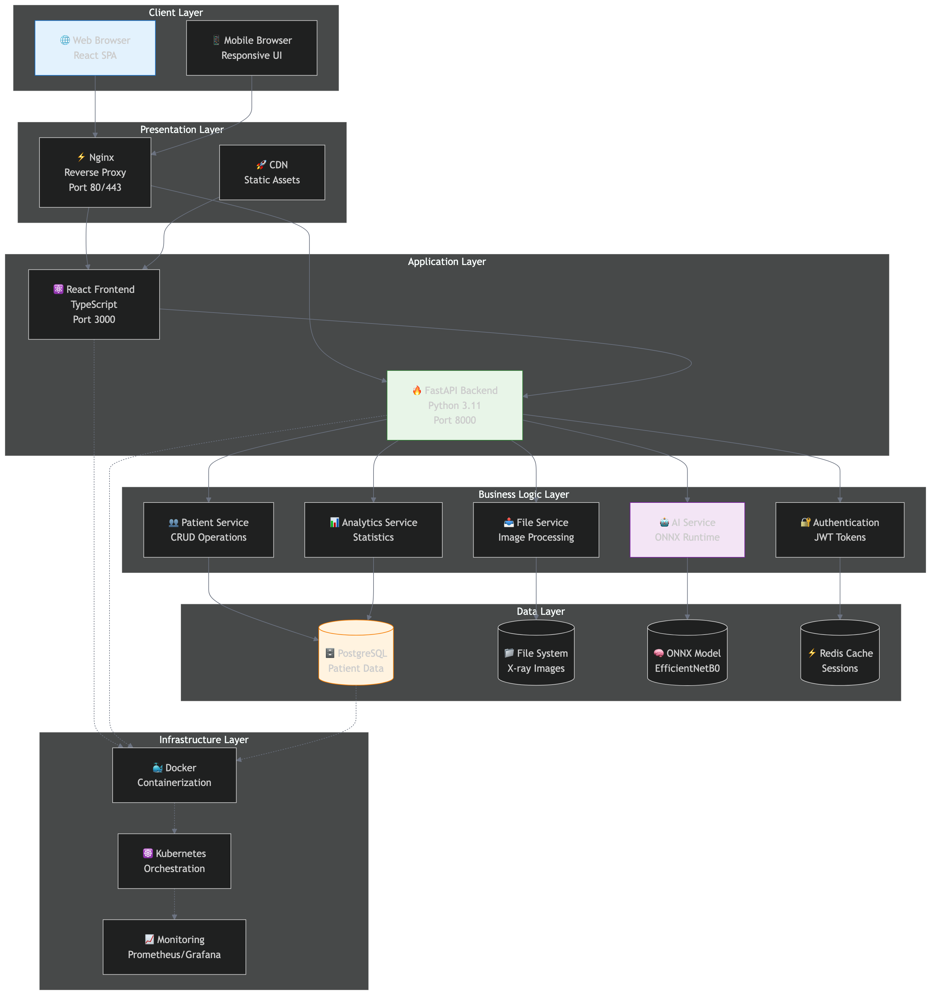
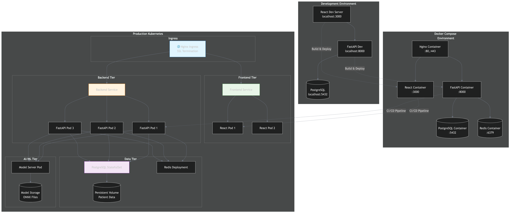
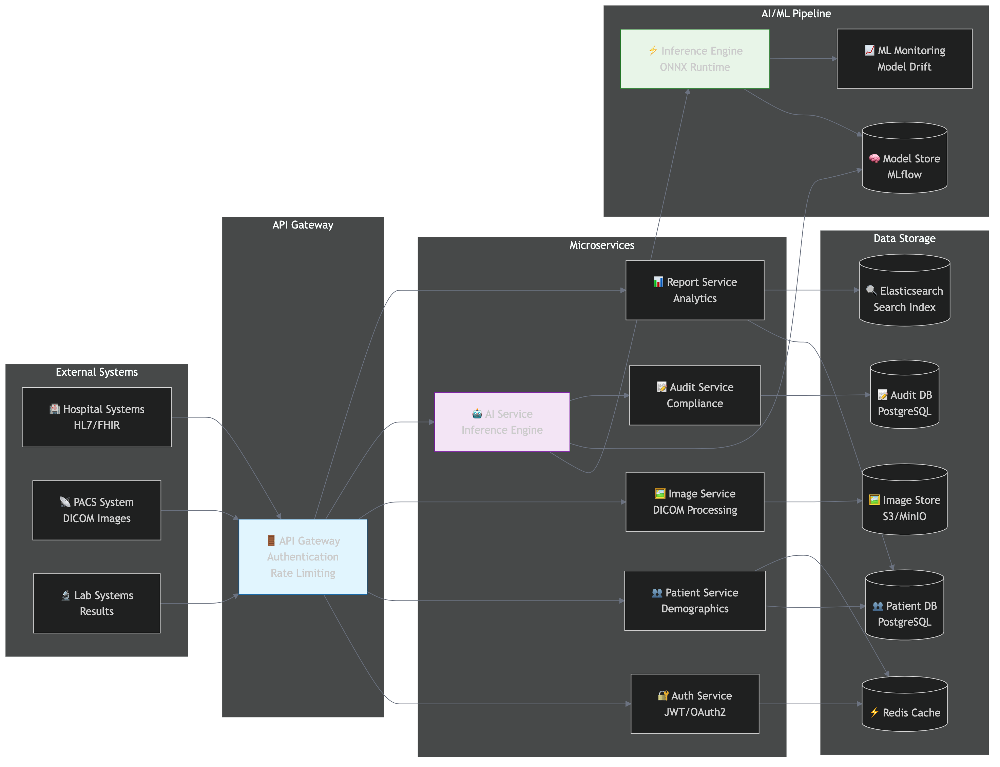
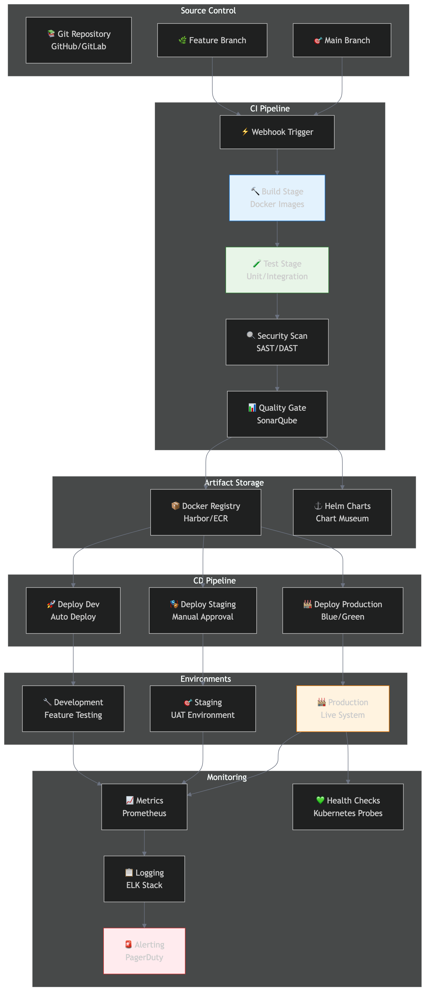
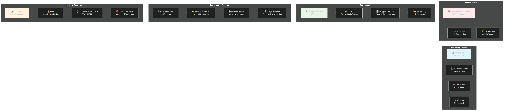
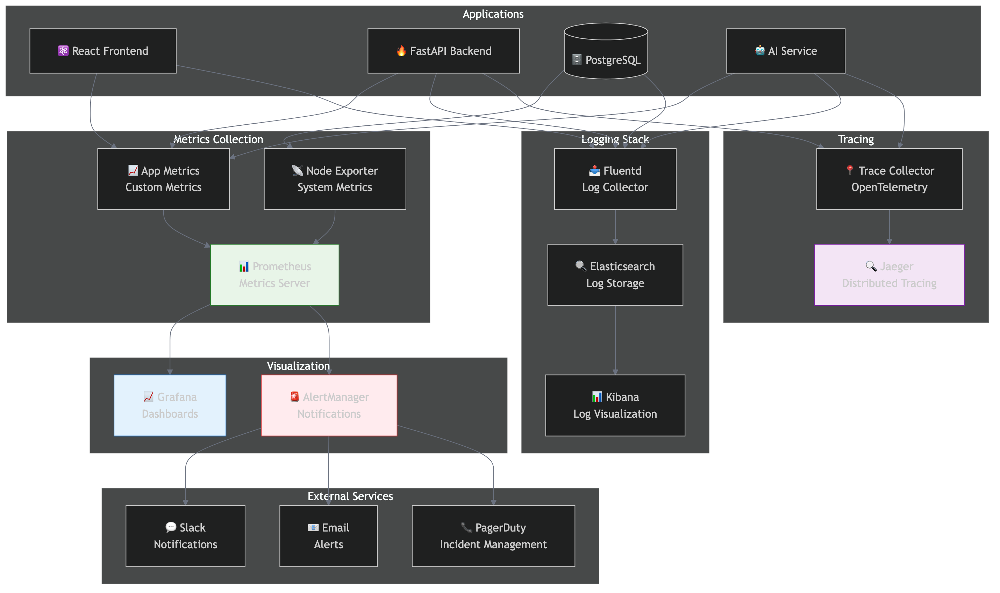

# 🏗️ System Architecture & Deployment Diagrams

> **📊 High-Quality Diagrams**: All architecture diagrams are available as PNG images in the [`docs/architecture-diagrams/`](docs/architecture-diagrams/) directory. The diagrams are generated from Mermaid source files and can be regenerated using the provided script.

## 🔧 Technical Architecture Overview



*The system follows a layered architecture pattern with clear separation of concerns from client interfaces through business logic to data persistence.*

## 🚀 Deployment Architecture



*Multi-environment deployment strategy from local development through Docker Compose to production Kubernetes with high availability and scalability.*

## 📊 Data Flow Architecture



*Microservices-based data flow with clear service boundaries, external system integrations, and comprehensive ML pipeline for AI inference.*

## 🔄 CI/CD Pipeline Architecture



*Comprehensive CI/CD pipeline with automated testing, security scanning, quality gates, and multi-environment deployment strategies.*

## 🛡️ Security Architecture



*Multi-layered security approach with network protection, application security, data encryption, infrastructure hardening, and comprehensive compliance monitoring.*

## 📈 Monitoring & Observability Stack



*Comprehensive observability stack with metrics collection, centralized logging, distributed tracing, and alerting for production monitoring.*

## 🔧 Technology Stack Specification

### Frontend Stack
```yaml
Framework: React 18.2+
Language: TypeScript 4.9+
Styling: TailwindCSS 3.3+
UI Components: ShadCN UI (Radix UI)
State Management: React Query (TanStack)
Routing: React Router v6
Build Tool: Create React App / Vite
Testing: Jest + React Testing Library
Package Manager: npm
```

### Backend Stack
```yaml
Framework: FastAPI 0.104+
Language: Python 3.11+
ORM: SQLAlchemy 2.0
Validation: Pydantic v2
Authentication: JWT + OAuth2
API Documentation: OpenAPI 3.0 (Swagger)
Testing: pytest + pytest-asyncio
Package Manager: pip + requirements.txt
ASGI Server: Uvicorn
```

### Database Stack
```yaml
Primary Database: PostgreSQL 15+
Cache: Redis 7+
Search Engine: Elasticsearch 8+ (optional)
Migrations: Alembic
Connection Pooling: SQLAlchemy Pool
Backup: pg_dump + Point-in-Time Recovery
```

### AI/ML Stack
```yaml
Runtime: ONNX Runtime 1.16+
Model: EfficientNetB0 (PyTorch → ONNX)
Image Processing: PIL + OpenCV
Numerical Computing: NumPy + SciPy
Model Serving: FastAPI endpoints
Performance: GPU acceleration support
```

### Infrastructure Stack
```yaml
Containerization: Docker + Docker Compose
Orchestration: Kubernetes 1.28+
Service Mesh: Istio (optional)
Ingress: Nginx Ingress Controller
CI/CD: GitHub Actions / GitLab CI
Registry: Docker Hub / Harbor
Secrets: Kubernetes Secrets / Vault
```

### Monitoring Stack
```yaml
Metrics: Prometheus + Grafana
Logging: ELK Stack (Elasticsearch, Logstash, Kibana)
Tracing: Jaeger + OpenTelemetry
APM: Grafana + Custom Dashboards
Alerts: AlertManager + PagerDuty
Health Checks: Kubernetes Probes
```

## 🚀 Deployment Strategies

### Development Deployment
```bash
# Local development with hot reload
docker-compose -f docker-compose.dev.yml up --build

# Services:
# - Frontend: http://localhost:3000 (hot reload)
# - Backend: http://localhost:8000 (auto-reload)
# - Database: localhost:5432
# - Redis: localhost:6379
```

### Staging Deployment
```bash
# Staging environment with production-like setup
docker-compose -f docker-compose.staging.yml up -d

# Features:
# - SSL certificates
# - Production database
# - Real ML models
# - Monitoring enabled
```

### Production Deployment
```yaml
# Kubernetes deployment with high availability
apiVersion: apps/v1
kind: Deployment
metadata:
  name: pneumonia-backend
spec:
  replicas: 3
  selector:
    matchLabels:
      app: pneumonia-backend
  template:
    spec:
      containers:
      - name: backend
        image: pneumonia/backend:v1.0.0
        ports:
        - containerPort: 8000
        env:
        - name: DATABASE_URL
          valueFrom:
            secretKeyRef:
              name: db-secret
              key: url
        resources:
          requests:
            memory: "512Mi"
            cpu: "500m"
          limits:
            memory: "1Gi"
            cpu: "1000m"
        livenessProbe:
          httpGet:
            path: /health
            port: 8000
          initialDelaySeconds: 30
          periodSeconds: 10
        readinessProbe:
          httpGet:
            path: /ready
            port: 8000
          initialDelaySeconds: 5
          periodSeconds: 5
```

Bu to'liq arxitektura va deployment diagramlari sizning pneumonia AI detection tizimingizning barcha technical jihatlarini qamrab oladi va production-ready deployment uchun tayyor! 🚀
