# 🏗️ System Architecture & Deployment Diagrams

## 🔧 Technical Architecture Overview

```mermaid
graph TB
    subgraph "Client Layer"
        WEB[🌐 Web Browser<br/>React SPA]
        MOB[📱 Mobile Browser<br/>Responsive UI]
    end

    subgraph "Presentation Layer"
        NGINX[⚡ Nginx<br/>Reverse Proxy<br/>Port 80/443]
        CDN[🚀 CDN<br/>Static Assets]
    end

    subgraph "Application Layer"
        REACT[⚛️ React Frontend<br/>TypeScript<br/>Port 3000]
        API[🔥 FastAPI Backend<br/>Python 3.11<br/>Port 8000]
    end

    subgraph "Business Logic Layer"
        AUTH[🔐 Authentication<br/>JWT Tokens]
        PATIENT[👥 Patient Service<br/>CRUD Operations]
        AI[🤖 AI Service<br/>ONNX Runtime]
        UPLOAD[📤 File Service<br/>Image Processing]
        STATS[📊 Analytics Service<br/>Statistics]
    end

    subgraph "Data Layer"
        DB[(🗄️ PostgreSQL<br/>Patient Data)]
        FILES[(📁 File System<br/>X-ray Images)]
        MODEL[(🧠 ONNX Model<br/>EfficientNetB0)]
        CACHE[(⚡ Redis Cache<br/>Sessions)]
    end

    subgraph "Infrastructure Layer"
        DOCKER[🐳 Docker<br/>Containerization]
        K8S[☸️ Kubernetes<br/>Orchestration]
        MONITOR[📈 Monitoring<br/>Prometheus/Grafana]
    end

    %% Client connections
    WEB --> NGINX
    MOB --> NGINX

    %% Proxy routing
    NGINX --> REACT
    NGINX --> API
    CDN --> REACT

    %% Application services
    REACT --> API
    API --> AUTH
    API --> PATIENT
    API --> AI
    API --> UPLOAD
    API --> STATS

    %% Data connections
    PATIENT --> DB
    AI --> MODEL
    UPLOAD --> FILES
    STATS --> DB
    AUTH --> CACHE

    %% Infrastructure
    REACT -.-> DOCKER
    API -.-> DOCKER
    DB -.-> DOCKER
    DOCKER -.-> K8S
    K8S -.-> MONITOR

    style WEB fill:#e3f2fd,stroke:#1976d2
    style API fill:#e8f5e8,stroke:#2e7d32
    style DB fill:#fff3e0,stroke:#f57c00
    style AI fill:#f3e5f5,stroke:#7b1fa2
```



## 🚀 Deployment Architecture

```mermaid
graph TB
    subgraph "Development Environment"
        DEV_FE[React Dev Server<br/>localhost:3000]
        DEV_BE[FastAPI Dev<br/>localhost:8000]
        DEV_DB[(PostgreSQL<br/>localhost:5432)]
        
        DEV_FE --> DEV_BE
        DEV_BE --> DEV_DB
    end

    subgraph "Docker Compose Environment"
        DC_NGINX[Nginx Container<br/>:80,:443]
        DC_FE[React Container<br/>:3000]
        DC_BE[FastAPI Container<br/>:8000]
        DC_DB[(PostgreSQL Container<br/>:5432)]
        DC_REDIS[(Redis Container<br/>:6379)]
        
        DC_NGINX --> DC_FE
        DC_NGINX --> DC_BE
        DC_BE --> DC_DB
        DC_BE --> DC_REDIS
    end

    subgraph "Production Kubernetes"
        subgraph "Ingress"
            INGRESS[🌐 Nginx Ingress<br/>SSL Termination]
        end
        
        subgraph "Frontend Tier"
            FE_POD1[React Pod 1]
            FE_POD2[React Pod 2]
            FE_SVC[Frontend Service]
        end
        
        subgraph "Backend Tier"
            BE_POD1[FastAPI Pod 1]
            BE_POD2[FastAPI Pod 2]
            BE_POD3[FastAPI Pod 3]
            BE_SVC[Backend Service]
        end
        
        subgraph "Data Tier"
            POSTGRES[PostgreSQL StatefulSet]
            REDIS[Redis Deployment]
            PVC[(Persistent Volume<br/>Patient Data)]
        end
        
        subgraph "AI/ML Tier"
            MODEL_POD[Model Server Pod]
            MODEL_PVC[(Model Storage<br/>ONNX Files)]
        end

        INGRESS --> FE_SVC
        INGRESS --> BE_SVC
        FE_SVC --> FE_POD1
        FE_SVC --> FE_POD2
        BE_SVC --> BE_POD1
        BE_SVC --> BE_POD2
        BE_SVC --> BE_POD3
        BE_POD1 --> POSTGRES
        BE_POD2 --> POSTGRES
        BE_POD3 --> POSTGRES
        BE_POD1 --> REDIS
        BE_POD2 --> REDIS
        BE_POD3 --> REDIS
        BE_POD1 --> MODEL_POD
        BE_POD2 --> MODEL_POD
        BE_POD3 --> MODEL_POD
        POSTGRES --> PVC
        MODEL_POD --> MODEL_PVC
    end

    DEV_FE -.->|Build & Deploy| DC_FE
    DEV_BE -.->|Build & Deploy| DC_BE
    DC_FE -.->|CI/CD Pipeline| FE_POD1
    DC_BE -.->|CI/CD Pipeline| BE_POD1

    style INGRESS fill:#e1f5fe,stroke:#01579b
    style FE_SVC fill:#e8f5e8,stroke:#2e7d32
    style BE_SVC fill:#fff3e0,stroke:#f57c00
    style POSTGRES fill:#f3e5f5,stroke:#7b1fa2
```



## 📊 Data Flow Architecture

```mermaid
graph LR
    subgraph "External Systems"
        HOSPITAL[🏥 Hospital Systems<br/>HL7/FHIR]
        PACS[📡 PACS System<br/>DICOM Images]
        LAB[🔬 Lab Systems<br/>Results]
    end

    subgraph "API Gateway"
        GATEWAY[🚪 API Gateway<br/>Authentication<br/>Rate Limiting]
    end

    subgraph "Microservices"
        AUTH_SVC[🔐 Auth Service<br/>JWT/OAuth2]
        PATIENT_SVC[👥 Patient Service<br/>Demographics]
        IMAGE_SVC[🖼️ Image Service<br/>DICOM Processing]
        AI_SVC[🤖 AI Service<br/>Inference Engine]
        REPORT_SVC[📊 Report Service<br/>Analytics]
        AUDIT_SVC[📝 Audit Service<br/>Compliance]
    end

    subgraph "Data Storage"
        PATIENT_DB[(👥 Patient DB<br/>PostgreSQL)]
        IMAGE_STORE[(🖼️ Image Store<br/>S3/MinIO)]
        AUDIT_DB[(📝 Audit DB<br/>PostgreSQL)]
        CACHE[(⚡ Redis Cache)]
        SEARCH[(🔍 Elasticsearch<br/>Search Index)]
    end

    subgraph "AI/ML Pipeline"
        MODEL_STORE[(🧠 Model Store<br/>MLflow)]
        INFERENCE[⚡ Inference Engine<br/>ONNX Runtime]
        MONITORING[📈 ML Monitoring<br/>Model Drift)]
    end

    %% External connections
    HOSPITAL --> GATEWAY
    PACS --> GATEWAY
    LAB --> GATEWAY

    %% Gateway routing
    GATEWAY --> AUTH_SVC
    GATEWAY --> PATIENT_SVC
    GATEWAY --> IMAGE_SVC
    GATEWAY --> AI_SVC
    GATEWAY --> REPORT_SVC

    %% Service dependencies
    PATIENT_SVC --> PATIENT_DB
    PATIENT_SVC --> CACHE
    IMAGE_SVC --> IMAGE_STORE
    AI_SVC --> INFERENCE
    AI_SVC --> MODEL_STORE
    REPORT_SVC --> PATIENT_DB
    REPORT_SVC --> SEARCH
    AUTH_SVC --> CACHE
    AUDIT_SVC --> AUDIT_DB

    %% ML pipeline
    INFERENCE --> MODEL_STORE
    INFERENCE --> MONITORING
    AI_SVC --> AUDIT_SVC

    style GATEWAY fill:#e1f5fe,stroke:#01579b
    style AI_SVC fill:#f3e5f5,stroke:#7b1fa2
    style INFERENCE fill:#e8f5e8,stroke:#2e7d32
```

## 🔄 CI/CD Pipeline Architecture

```mermaid
graph TB
    subgraph "Source Control"
        GIT[📚 Git Repository<br/>GitHub/GitLab]
        BRANCH[🌿 Feature Branch]
        MAIN[🎯 Main Branch]
    end

    subgraph "CI Pipeline"
        TRIGGER[⚡ Webhook Trigger]
        BUILD[🔨 Build Stage<br/>Docker Images]
        TEST[🧪 Test Stage<br/>Unit/Integration]
        SCAN[🔍 Security Scan<br/>SAST/DAST]
        QUALITY[📊 Quality Gate<br/>SonarQube]
    end

    subgraph "Artifact Storage"
        REGISTRY[📦 Docker Registry<br/>Harbor/ECR]
        HELM[⚓ Helm Charts<br/>Chart Museum]
    end

    subgraph "CD Pipeline"
        DEPLOY_DEV[🚀 Deploy Dev<br/>Auto Deploy]
        DEPLOY_STAGE[🎭 Deploy Staging<br/>Manual Approval]
        DEPLOY_PROD[🏭 Deploy Production<br/>Blue/Green]
    end

    subgraph "Environments"
        DEV[🔧 Development<br/>Feature Testing]
        STAGE[🎯 Staging<br/>UAT Environment]
        PROD[🏭 Production<br/>Live System]
    end

    subgraph "Monitoring"
        METRICS[📈 Metrics<br/>Prometheus]
        LOGS[📋 Logging<br/>ELK Stack]
        ALERTS[🚨 Alerting<br/>PagerDuty]
        HEALTH[💚 Health Checks<br/>Kubernetes Probes]
    end

    %% Source flow
    BRANCH --> TRIGGER
    MAIN --> TRIGGER

    %% CI flow
    TRIGGER --> BUILD
    BUILD --> TEST
    TEST --> SCAN
    SCAN --> QUALITY
    QUALITY --> REGISTRY
    QUALITY --> HELM

    %% CD flow
    REGISTRY --> DEPLOY_DEV
    REGISTRY --> DEPLOY_STAGE
    REGISTRY --> DEPLOY_PROD
    DEPLOY_DEV --> DEV
    DEPLOY_STAGE --> STAGE
    DEPLOY_PROD --> PROD

    %% Monitoring
    DEV --> METRICS
    STAGE --> METRICS
    PROD --> METRICS
    METRICS --> LOGS
    LOGS --> ALERTS
    PROD --> HEALTH

    style BUILD fill:#e3f2fd,stroke:#1976d2
    style TEST fill:#e8f5e8,stroke:#2e7d32
    style PROD fill:#fff3e0,stroke:#f57c00
    style ALERTS fill:#ffebee,stroke:#d32f2f
```



## 🛡️ Security Architecture

```mermaid
graph TB
    subgraph "Network Security"
        WAF[🛡️ Web Application Firewall<br/>OWASP Protection]
        LB[⚖️ Load Balancer<br/>SSL Termination]
        VPN[🔒 VPN Gateway<br/>Admin Access]
    end

    subgraph "Application Security"
        AUTH[🔐 Authentication<br/>OAuth2/SAML]
        RBAC[👤 Role-Based Access<br/>Authorization]
        JWT[🎟️ JWT Tokens<br/>Stateless Auth]
        API_KEY[🔑 API Keys<br/>Service Auth]
    end

    subgraph "Data Security"
        ENCRYPT[🔒 Encryption at Rest<br/>AES-256]
        TLS[🔐 TLS 1.3<br/>Encryption in Transit]
        BACKUP[💾 Encrypted Backups<br/>Point-in-Time Recovery]
        MASK[🎭 Data Masking<br/>PHI Protection]
    end

    subgraph "Infrastructure Security"
        RBAC_K8S[🔐 Kubernetes RBAC<br/>Pod Security]
        SECRET[🔒 Secret Management<br/>Vault/K8s Secrets]
        NETWORK[🌐 Network Policies<br/>Microsegmentation]
        SCAN_IMG[🔍 Image Scanning<br/>Vulnerability Detection]
    end

    subgraph "Compliance & Monitoring"
        AUDIT[📝 Audit Logging<br/>HIPAA Compliance]
        SIEM[🕵️ SIEM<br/>Security Monitoring]
        COMPLIANCE[⚖️ Compliance Dashboard<br/>SOC2/HIPAA]
        INCIDENT[🚨 Incident Response<br/>Automated Workflows]
    end

    %% Security layers
    WAF --> LB
    LB --> AUTH
    AUTH --> RBAC
    RBAC --> JWT
    JWT --> API_KEY

    %% Data protection
    ENCRYPT --> TLS
    TLS --> BACKUP
    BACKUP --> MASK

    %% Infrastructure
    RBAC_K8S --> SECRET
    SECRET --> NETWORK
    NETWORK --> SCAN_IMG

    %% Monitoring
    AUDIT --> SIEM
    SIEM --> COMPLIANCE
    COMPLIANCE --> INCIDENT

    style WAF fill:#ffebee,stroke:#d32f2f
    style AUTH fill:#e1f5fe,stroke:#01579b
    style ENCRYPT fill:#e8f5e8,stroke:#2e7d32
    style AUDIT fill:#fff3e0,stroke:#f57c00
```



## 📈 Monitoring & Observability Stack

```mermaid
graph TB
    subgraph "Applications"
        FE[⚛️ React Frontend]
        BE[🔥 FastAPI Backend]
        DB[(🗄️ PostgreSQL)]
        AI[🤖 AI Service]
    end

    subgraph "Metrics Collection"
        PROM[📊 Prometheus<br/>Metrics Server]
        NODE[📡 Node Exporter<br/>System Metrics]
        APP[📈 App Metrics<br/>Custom Metrics]
    end

    subgraph "Logging Stack"
        FLUENTD[📤 Fluentd<br/>Log Collector]
        ELASTIC[🔍 Elasticsearch<br/>Log Storage]
        KIBANA[📊 Kibana<br/>Log Visualization]
    end

    subgraph "Tracing"
        JAEGER[🔍 Jaeger<br/>Distributed Tracing]
        TRACE[📍 Trace Collector<br/>OpenTelemetry]
    end

    subgraph "Visualization"
        GRAFANA[📈 Grafana<br/>Dashboards]
        ALERTS[🚨 AlertManager<br/>Notifications]
    end

    subgraph "External Services"
        SLACK[💬 Slack<br/>Notifications]
        EMAIL[📧 Email<br/>Alerts]
        PAGER[📞 PagerDuty<br/>Incident Management]
    end

    %% Metrics flow
    FE --> APP
    BE --> APP
    DB --> NODE
    AI --> APP
    APP --> PROM
    NODE --> PROM

    %% Logging flow
    FE --> FLUENTD
    BE --> FLUENTD
    DB --> FLUENTD
    AI --> FLUENTD
    FLUENTD --> ELASTIC
    ELASTIC --> KIBANA

    %% Tracing flow
    BE --> TRACE
    AI --> TRACE
    TRACE --> JAEGER

    %% Visualization
    PROM --> GRAFANA
    PROM --> ALERTS
    ALERTS --> SLACK
    ALERTS --> EMAIL
    ALERTS --> PAGER

    style PROM fill:#e8f5e8,stroke:#2e7d32
    style GRAFANA fill:#e3f2fd,stroke:#1976d2
    style ALERTS fill:#ffebee,stroke:#d32f2f
    style JAEGER fill:#f3e5f5,stroke:#7b1fa2
```



## 🔧 Technology Stack Specification

### Frontend Stack
```yaml
Framework: React 18.2+
Language: TypeScript 4.9+
Styling: TailwindCSS 3.3+
UI Components: ShadCN UI (Radix UI)
State Management: React Query (TanStack)
Routing: React Router v6
Build Tool: Create React App / Vite
Testing: Jest + React Testing Library
Package Manager: npm
```

### Backend Stack
```yaml
Framework: FastAPI 0.104+
Language: Python 3.11+
ORM: SQLAlchemy 2.0
Validation: Pydantic v2
Authentication: JWT + OAuth2
API Documentation: OpenAPI 3.0 (Swagger)
Testing: pytest + pytest-asyncio
Package Manager: pip + requirements.txt
ASGI Server: Uvicorn
```

### Database Stack
```yaml
Primary Database: PostgreSQL 15+
Cache: Redis 7+
Search Engine: Elasticsearch 8+ (optional)
Migrations: Alembic
Connection Pooling: SQLAlchemy Pool
Backup: pg_dump + Point-in-Time Recovery
```

### AI/ML Stack
```yaml
Runtime: ONNX Runtime 1.16+
Model: EfficientNetB0 (PyTorch → ONNX)
Image Processing: PIL + OpenCV
Numerical Computing: NumPy + SciPy
Model Serving: FastAPI endpoints
Performance: GPU acceleration support
```

### Infrastructure Stack
```yaml
Containerization: Docker + Docker Compose
Orchestration: Kubernetes 1.28+
Service Mesh: Istio (optional)
Ingress: Nginx Ingress Controller
CI/CD: GitHub Actions / GitLab CI
Registry: Docker Hub / Harbor
Secrets: Kubernetes Secrets / Vault
```

### Monitoring Stack
```yaml
Metrics: Prometheus + Grafana
Logging: ELK Stack (Elasticsearch, Logstash, Kibana)
Tracing: Jaeger + OpenTelemetry
APM: Grafana + Custom Dashboards
Alerts: AlertManager + PagerDuty
Health Checks: Kubernetes Probes
```

## 🚀 Deployment Strategies

### Development Deployment
```bash
# Local development with hot reload
docker-compose -f docker-compose.dev.yml up --build

# Services:
# - Frontend: http://localhost:3000 (hot reload)
# - Backend: http://localhost:8000 (auto-reload)
# - Database: localhost:5432
# - Redis: localhost:6379
```

### Staging Deployment
```bash
# Staging environment with production-like setup
docker-compose -f docker-compose.staging.yml up -d

# Features:
# - SSL certificates
# - Production database
# - Real ML models
# - Monitoring enabled
```

### Production Deployment
```yaml
# Kubernetes deployment with high availability
apiVersion: apps/v1
kind: Deployment
metadata:
  name: pneumonia-backend
spec:
  replicas: 3
  selector:
    matchLabels:
      app: pneumonia-backend
  template:
    spec:
      containers:
      - name: backend
        image: pneumonia/backend:v1.0.0
        ports:
        - containerPort: 8000
        env:
        - name: DATABASE_URL
          valueFrom:
            secretKeyRef:
              name: db-secret
              key: url
        resources:
          requests:
            memory: "512Mi"
            cpu: "500m"
          limits:
            memory: "1Gi"
            cpu: "1000m"
        livenessProbe:
          httpGet:
            path: /health
            port: 8000
          initialDelaySeconds: 30
          periodSeconds: 10
        readinessProbe:
          httpGet:
            path: /ready
            port: 8000
          initialDelaySeconds: 5
          periodSeconds: 5
```

Bu to'liq arxitektura va deployment diagramlari sizning pneumonia AI detection tizimingizning barcha technical jihatlarini qamrab oladi va production-ready deployment uchun tayyor! 🚀
